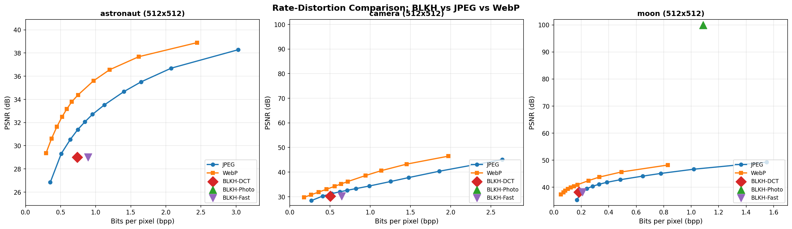

# Rate-Distortion (RD) Plot Report

**Date**: 2026-06-27 18:19:56
**Images**: 3 real scikit-image photographs
**Codecs compared**: JPEG (11 quality levels), WebP (11 quality levels), BLKH (3 modes)

---

## Plot

## Interpretation

In an RD plot, **lower-right is better** (less bits per pixel, higher PSNR).

### astronaut (512x512)

| Codec | Quality | bpp | PSNR (dB) | Size (bytes) |
|-------|---------|-----|-----------|--------------|
| JPEG | q=10 | 0.353 | 26.8 | 11564 |
| JPEG | q=20 | 0.509 | 29.3 | 16678 |
| JPEG | q=30 | 0.638 | 30.5 | 20912 |
| JPEG | q=40 | 0.745 | 31.4 | 24421 |
| JPEG | q=50 | 0.847 | 32.1 | 27748 |
| JPEG | q=60 | 0.955 | 32.7 | 31288 |
| JPEG | q=70 | 1.123 | 33.5 | 36800 |
| JPEG | q=80 | 1.403 | 34.7 | 45960 |
| JPEG | q=85 | 1.647 | 35.5 | 53962 |
| JPEG | q=90 | 2.077 | 36.7 | 68052 |
| JPEG | q=95 | 3.031 | 38.3 | 99308 |
| WebP | q=10 | 0.293 | 29.4 | 9600 |
| WebP | q=20 | 0.370 | 30.6 | 12120 |
| WebP | q=30 | 0.447 | 31.6 | 14652 |
| WebP | q=40 | 0.521 | 32.5 | 17066 |
| WebP | q=50 | 0.589 | 33.2 | 19290 |
| WebP | q=60 | 0.659 | 33.8 | 21610 |
| WebP | q=70 | 0.748 | 34.4 | 24506 |
| WebP | q=80 | 0.968 | 35.6 | 31724 |
| WebP | q=85 | 1.197 | 36.6 | 39238 |
| WebP | q=90 | 1.615 | 37.7 | 52912 |
| WebP | q=95 | 2.443 | 38.9 | 80056 |
| BLKH-DCT | - | 0.736 | 29.0 | 24133 |
| BLKH-Photo | - | 5.533 | 36.9 | 181300 |
| BLKH-Fast | - | 0.893 | 29.0 | 29250 |

### camera (512x512)

| Codec | Quality | bpp | PSNR (dB) | Size (bytes) |
|-------|---------|-----|-----------|--------------|
| JPEG | q=10 | 0.270 | 28.4 | 8844 |
| JPEG | q=20 | 0.409 | 30.2 | 13400 |
| JPEG | q=30 | 0.523 | 31.3 | 17134 |
| JPEG | q=40 | 0.622 | 32.0 | 20396 |
| JPEG | q=50 | 0.716 | 32.6 | 23465 |
| JPEG | q=60 | 0.823 | 33.3 | 26972 |
| JPEG | q=70 | 0.990 | 34.3 | 32428 |
| JPEG | q=80 | 1.256 | 36.2 | 41158 |
| JPEG | q=85 | 1.478 | 37.8 | 48431 |
| JPEG | q=90 | 1.858 | 40.3 | 60889 |
| JPEG | q=95 | 2.643 | 45.1 | 86612 |
| WebP | q=10 | 0.177 | 29.7 | 5804 |
| WebP | q=20 | 0.267 | 30.8 | 8734 |
| WebP | q=30 | 0.359 | 31.8 | 11750 |
| WebP | q=40 | 0.458 | 33.0 | 15020 |
| WebP | q=50 | 0.558 | 34.2 | 18290 |
| WebP | q=60 | 0.639 | 35.2 | 20944 |
| WebP | q=70 | 0.723 | 36.2 | 23686 |
| WebP | q=80 | 0.942 | 38.6 | 30866 |
| WebP | q=85 | 1.138 | 40.6 | 37290 |
| WebP | q=90 | 1.453 | 43.2 | 47612 |
| WebP | q=95 | 1.973 | 46.5 | 64648 |
| BLKH-DCT | - | 0.504 | 30.2 | 16528 |
| BLKH-Photo | - | 3.986 | 100.0 | 130610 |
| BLKH-Fast | - | 0.645 | 30.2 | 21149 |

### moon (512x512)

| Codec | Quality | bpp | PSNR (dB) | Size (bytes) |
|-------|---------|-----|-----------|--------------|
| JPEG | q=10 | 0.168 | 35.2 | 5502 |
| JPEG | q=20 | 0.200 | 38.2 | 6553 |
| JPEG | q=30 | 0.239 | 39.5 | 7834 |
| JPEG | q=40 | 0.283 | 40.3 | 9269 |
| JPEG | q=50 | 0.330 | 41.1 | 10814 |
| JPEG | q=60 | 0.387 | 41.8 | 12688 |
| JPEG | q=70 | 0.483 | 42.7 | 15831 |
| JPEG | q=80 | 0.647 | 44.1 | 21217 |
| JPEG | q=85 | 0.780 | 45.1 | 25559 |
| JPEG | q=90 | 1.018 | 46.6 | 33367 |
| JPEG | q=95 | 1.548 | 49.2 | 50737 |
| WebP | q=10 | 0.052 | 37.3 | 1690 |
| WebP | q=20 | 0.069 | 38.1 | 2266 |
| WebP | q=30 | 0.084 | 38.7 | 2746 |
| WebP | q=40 | 0.102 | 39.4 | 3334 |
| WebP | q=50 | 0.122 | 39.9 | 4008 |
| WebP | q=60 | 0.146 | 40.4 | 4788 |
| WebP | q=70 | 0.172 | 40.9 | 5620 |
| WebP | q=80 | 0.253 | 42.4 | 8280 |
| WebP | q=85 | 0.331 | 43.7 | 10830 |
| WebP | q=90 | 0.492 | 45.6 | 16112 |
| WebP | q=95 | 0.829 | 48.2 | 27162 |
| BLKH-DCT | - | 0.182 | 38.2 | 5961 |
| BLKH-Photo | - | 1.086 | 100.0 | 35584 |
| BLKH-Fast | - | 0.208 | 38.2 | 6821 |

## Honest Assessment

The RD plot shows where BLKH sits in the rate-distortion landscape:

- **BLKH operates at lower bpp than JPEG/WebP** (smaller files)
- **BLKH PSNR is lower than JPEG/WebP at high quality** (more lossy)
- **BLKH may dominate at very low bitrates** (where JPEG quality drops sharply)

This is the honest trade-off: BLKH excels at aggressive compression but
sacrifices quality. The paper should document this clearly.
